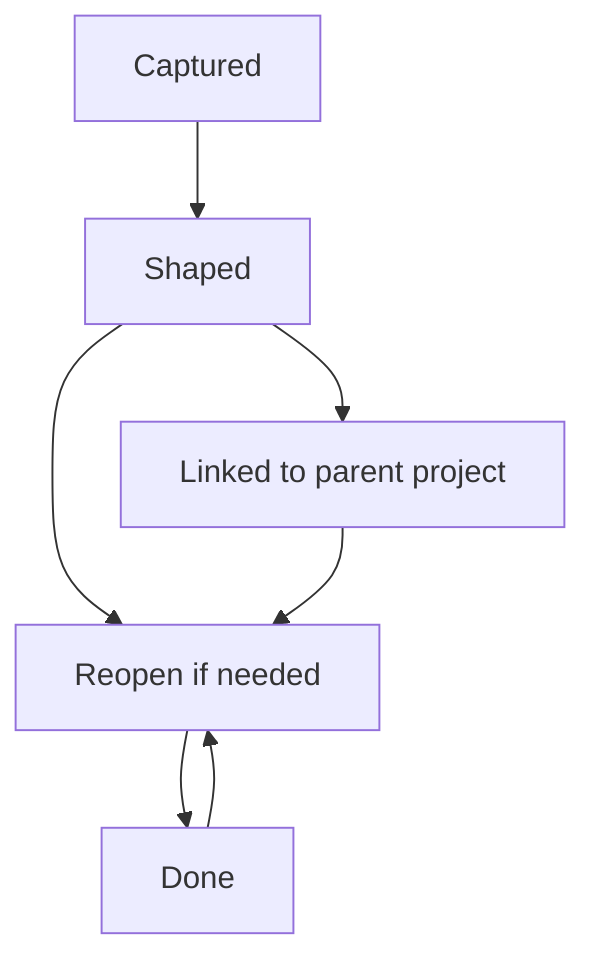

# Site Build And Iterations

## Purpose
This document explains what JobJar is becoming, how the product has evolved, and how the current live build is structured.

JobJar started as a household task board. It has now been reframed into a capture-first household work system:

- notice something in the real world
- capture it quickly
- shape it into useful work
- assign, schedule, or expand it
- surface the right summary on TV for the family

The TV experience remains the stable family-facing view. The main and admin experiences are now the operating system behind it.

## Product Direction
JobJar is for reducing mental load at the moment of noticing.

It is designed for things like:

- low tyre pressure on a family car
- stairs that need hoovering
- a bedroom that needs decorating
- front and back garden work
- an attic that needs sorting, dumping, or donating

These are all "jobs", but not the same kind of job.

The product now treats a captured item as something that may become:

- upkeep
- issue
- project
- clear-out
- outdoor work
- planning work

## Current Experience Map

```mermaid
flowchart LR
  A[Notice something] --> B[/ Capture on Home]
  B --> C[Captured job in Inbox]
  C --> D[/ Admin shaping]
  D --> E[Typed and staged job]
  E --> F[Assigned or scheduled]
  F --> G[Active work]
  G --> H[Done]
  E --> I[Parent project]
  I --> J[Child jobs]
  F --> K[/ TV summary]
  G --> K
  H --> K
```

## Core Surfaces

### `/`
The main product surface.

This is now the household capture desk:

- quick capture input
- fresh captures
- jobs that need shaping
- active pressure
- bigger work and projects
- recently done work

### `/admin`
The shaping workspace.

This is where raw captures become structured household jobs:

- people
- spaces
- jobs
- type
- stage
- owner
- due date
- parent project
- notes and location detail

### `/tv`
The family summary board.

This remains the public household output:

- metrics
- room progress
- RAG summaries
- completion visibility

### `/login`
Bootstrap and sign-in flow:

- first-run admin creation
- per-user passcodes

### `/api/health/db`
Operational DB connectivity check.

## Data Model Evolution

### Original shape
The app previously relied heavily on flat tasks with limited interpretation.

### Current shape
The `Task` model now carries richer capture metadata:

- `jobKind`
- `captureStage`
- `detailNotes`
- `locationDetails`
- `projectParentId`

This allows one captured item to become:

- a simple one-off job
- a live issue
- a larger project
- a child job inside a project

## Current Job Lifecycle



## Key Build Iterations

## 1. Baseline App
- Next.js app scaffolded in `web/`
- Prisma, PostgreSQL, and seed workflow added
- dashboard, admin, and TV surfaces established

## 2. Household Operations
- rooms, tasks, assignments, recurrence, and task state flow added
- mobile-first admin and daily usage patterns introduced

## 3. Family UX Layer
- TV dashboard designed as the household-facing board
- daily and admin surfaces redesigned several times for clarity and family use

## 4. Auth And Production Hardening
- custom login flow added
- per-user passcodes added
- Vercel build and Prisma deployment path stabilized
- initial migrations committed

## 5. Capture-First Reframe
- home page reframed as a capture desk
- admin language shifted from setup to shaping
- product direction changed from "task board" to "notice, capture, shape, move"

## 6. Capture Model Upgrade
- `jobKind` and `captureStage` added
- parent/child project support added
- richer detail fields added
- admin shaping controls extended

## Deployment Notes

### Vercel
- root directory: `web`
- build command comes from `web/vercel.json`
- Vercel runs `npm run build:vercel`

### Prisma
- `build` regenerates Prisma client
- `build:vercel` regenerates Prisma client and runs `prisma migrate deploy`
- `DIRECT_URL` falls back to `DATABASE_URL` in scripts

### Fresh production setup
Expected first-run state:

- DB connects successfully
- migrations create schema
- no demo seed data exists by default
- `/login` shows `Create Admin`

## Validation Routine
The current standard checks are:

```bash
cd web
npm run db:generate
npm run lint
env -u DIRECT_URL npm run build
```

## What Is Stable
- TV as the family-facing experience
- Vercel + Prisma deployment path
- per-user login model
- capture-first product framing
- typed jobs with project-parent support

## What Still Wants Iteration
- a dedicated shaping action directly on the home screen
- richer child-job and project breakdown UX
- materials, shopping, dump/donate flows
- better search and filtering across captures
- more explicit project rollups on TV and admin

## Source Of Truth
- schema: `web/prisma/schema.prisma`
- migrations: `web/prisma/migrations/`
- runtime product surfaces:
  - `web/src/app/page.tsx`
  - `web/src/app/admin/page.tsx`
  - `web/src/app/tv/page.tsx`
