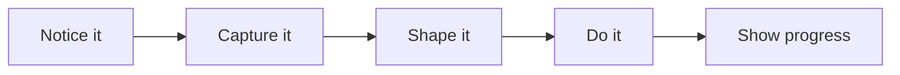
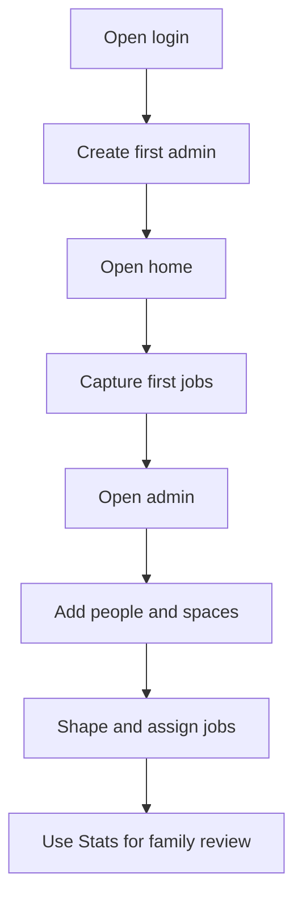
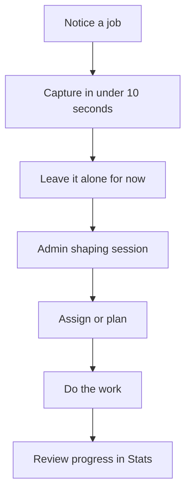

# JobJar User Guide

## What JobJar Is For
JobJar is for getting household jobs out of your head quickly.

If you notice something, record it.

Examples:

- a tyre pressure warning
- stairs that need hoovering
- a room that needs decorating
- garden work
- an attic clear-out

You do not need to fully define the job at the moment you notice it.

That is the point.

## The Simple Idea

## Main Screens

## 1. Home
The home screen is the capture desk.

Use it to:

- record a job quickly
- see what is newly captured
- see what needs shaping
- see what is active
- see bigger projects
- see what is done

## 2. Admin
Admin is where a rough capture becomes proper work.

Use it to:

- add people
- define spaces
- assign jobs
- set type and stage
- add notes and location details
- connect a job to a larger parent project

## Roles

- Admin: full setup access, including people, rooms, and task shaping.
- Power user: can manage projects, milestones, materials, and project planning without full setup access.
- Member: can use the normal task workflow.
- Viewer: read-only.

## 3. Stats
Stats is the household summary board.

Use it for:

- shared visibility
- overall progress
- recurring task health
- recent completions
- simple household-level awareness
- project budget and risk review

## 4. Projects
Projects is where bigger work is reviewed as a plan rather than a single task.

Use it for:

- promoting a task into a project
- setting a target date
- setting a rough budget
- adding child tasks
- recording spend as simple cost lines
- tracking materials to buy
- tracking milestones

## 5. Project Timeline
Timeline is the date view for project work.

Use it for:

- seeing what is overdue
- seeing what is coming up next
- reviewing recent milestone and child-task completions
- spotting projects with no dates at all

## First-Time Setup

## Normal Daily Flow

## Step 1: Capture
When you notice something, open Home and type it into Quick Capture.

Examples:

- "Tyre pressure warning on Eva's car"
- "Hoover stairs"
- "Bedroom repaint"
- "Sort front garden"
- "Clear attic and donation run"

Do not overthink it.

## Step 2: Shape
Later, open Admin and give the captured item structure.

You can decide:

- what kind of job it is
- what stage it is in
- which space it belongs to
- who owns it
- whether it has a due date
- whether it belongs to a bigger parent project

## Step 3: Move
Once shaped, the job can be started and completed.

Jobs move through stages like:

- captured
- shaped
- active
- done

## Step 4: Review
Use Stats to keep the household aligned.

## Step 5: Expand
If a task is too big to stay as one item, open `/projects` or `/tasks` and promote it into a project.

Then:

- add a target date
- add a rough budget if useful
- break the work into child tasks
- record spend as the project moves
- add materials that still need to be bought
- add milestones when you want checkpoints
- use Timeline to review the date view across all projects

## Job Types
JobJar supports different kinds of household jobs.

## Upkeep
Regular household maintenance.

Examples:

- hoover stairs
- mop floors
- empty bins

## Issue
A problem or warning that needs checking or fixing.

Examples:

- tyre pressure warning
- dripping tap
- broken handle

## Project
Bigger work that should become smaller jobs.

Examples:

- decorate bedroom
- redo office
- organize shed

## Clear-out
Sorting and removal work.

Examples:

- clear attic
- sort garage
- donate toys

## Outdoor
Garden or outside work.

Examples:

- front garden tidy
- back hedge cut
- patio wash

## Planning
Something that needs deciding or sequencing before action.

Examples:

- plan paint colours
- sort garden priorities
- decide attic storage layout

## Parent Projects And Child Jobs
Some jobs are too big to stay as one item.

Example:

Parent project:
- Bedroom needs decorating

Child jobs:
- choose paint
- clear furniture
- patch walls
- paint ceiling
- paint walls
- reinstall room

Use Admin to connect smaller jobs to a parent project.

Use Projects to manage the parent item once it becomes active planning work.

## Recommended Household Habit

## Best Practice
- Capture fast.
- Shape later.
- Use short job titles.
- Put extra detail in notes.
- Use spaces to anchor work in the real world.
- Use parent projects for anything that is obviously multi-step.
- Keep the stats view simple and useful.
- Use budgets as rough household guidance, not accounting.
- Use milestones for checkpoints, not for every tiny action.

## Example Walkthroughs

## Example 1: Low tyre pressure
1. Capture: "Low tyre pressure on Mia's car"
2. Shape it as:
   - type: issue
   - space: car / outside
   - owner: parent or daughter
   - note: "Check front-left tyre first"
3. Start it when someone begins checking it.
4. Mark done when resolved.

## Example 2: Stairs need hoovering
1. Capture: "Hoover stairs"
2. Shape it as:
   - type: upkeep
   - space: hallway / stairs
   - owner: whoever is doing it
3. Complete it as a normal job.

## Example 3: Bedroom needs decorating
1. Capture: "Bedroom needs decorating"
2. Shape it as:
   - type: project
   - stage: shaped
   - note: "Needs colours, prep, paint, tidy back"
3. Add child jobs in Admin.

## Example 4: Garden work
1. Capture: "Front and back garden need sorting"
2. Shape it as:
   - type: outdoor
   - parent project if large
3. Break into smaller jobs:
   - front garden tidy
   - back lawn edge
   - hedge trim
   - dump garden waste

## Example 5: Attic clear-out
1. Capture: "Attic clear-out"
2. Shape it as:
   - type: clear-out
   - note: "Keep / donate / dump"
3. Create child jobs:
   - sort boxes
   - bag donation items
   - book dump run
   - relabel storage

## If Something Goes Wrong

## Login problems
- make sure the first admin exists
- check the database is connected

## Database problems
Open `/api/health/db`.

You want:

- `status: "ok"`
- `db: "connected"`

## Final Rule
If you notice it, capture it.

You do not need to define the whole job immediately.

That is what JobJar is for.
