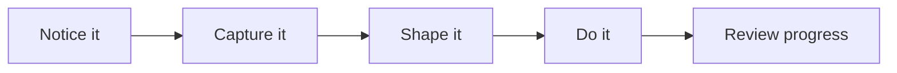

# JobJar Guide Hub

JobJar now has different experiences for different people in the household.

Use this page as the starting point, then open the guide that matches the person you are helping.

## Which guide to use

- [Adults guide](./adults-guide.md): for admins, power users, and members who manage the household board.
- [Teens guide](./teens-guide.md): for `12 to 18` users who can work from the task board with simpler language and brighter styling.
- [Kids guide](./kids-guide.md): for `under 12` users who only see jobs picked for them.
- [Grandparents guide](./grandparents-guide.md): for read-only or light-use family members who mainly need to check what is happening.

## The simple idea

## Main screens

- `/`: home screen with the main cards for the signed-in person
- `/log`: fast capture for people who can add work
- `/tasks`: the shared task board
- `/projects`: larger work with steps, milestones, materials, and budget
- `/projects/timeline`: date view for projects
- `/stats`: household and project reporting
- `/settings/people`: people, age groups, themes, and location access

## Roles

- `admin`: full setup and management access
- `power_user`: can manage projects and people age/theme settings without full admin access
- `member`: normal task workflow
- `viewer`: read-only

## Audience bands

- `adult`: full household UI
- `teen_12_18`: brighter teen-focused UI with simpler wording
- `under_12`: playful job-only UI limited to assigned work

## Good setup habits

- Keep titles short and clear.
- Put extra detail in notes.
- Promote a task to a project when it becomes multi-step.
- Use location access when someone should only see part of the household.
- Use `viewer` for family members who should read, not edit.
